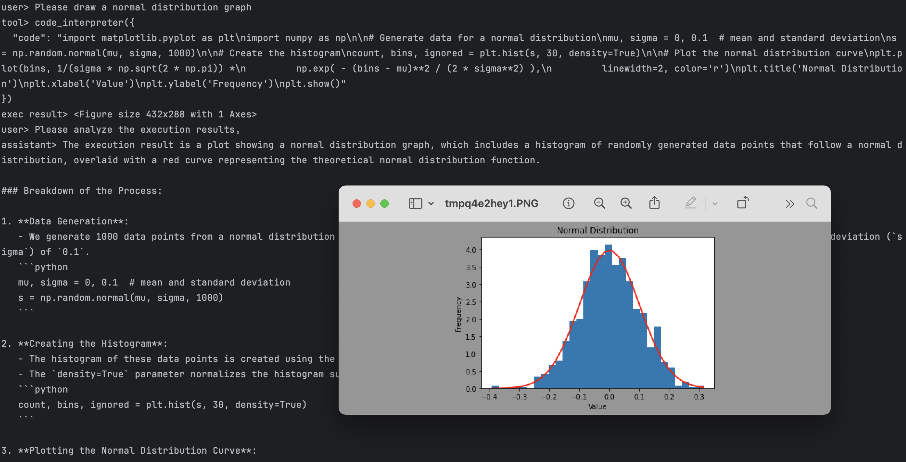

## fcoder
Easy code interpreter for use
```
pip3 install fcoder
```

pull fcoder server, token needs to be replaced
```
docker run --rm -e TOKEN="YOUR_AUTH_TOKEN" -p 127.0.0.1:8888:8888 qingzhaoli/fcoder-server:latest
```

test server alive
```
curl http://127.0.0.1:8888
{"reason": "Not Found", "message": ""}
```

## Example
```
from fcoder import CoderClient
coder_server_auth_token = "241b2687-e3f2-43b5-826b-cb91e8be6b08"
client = CoderClient(
    server_host="127.0.0.1",
    server_port=8888,
    auth_token=coder_server_auth_token
)
result = client.code_interpreter("print('hello')")
------
result.model_dump_json(indent=4)
>>> {
        "status": "ok",
        "output": [
            {
                "text/plain": "hello\n"
            }
        ],
        "error_trace": null,
        "message": ""
    }
```

Error message 
```
result = client.code_interpreter("print('hell")
------
{
    "status": "error",
    "output": [],
    "error_trace": {
        "ename": "SyntaxError",
        "evalue": "unterminated string literal (detected at line 1) (<ipython-input-1-afde1e468564>, line 1)",
        "traceback": [
            "\u001b[0;36m  Cell \u001b[0;32mIn[1], line 1\u001b[0;36m\u001b[0m\n\u001b[0;31m    print('hell\u001b[0m\n\u001b[0m          ^\u001b[0m\n\u001b[0;31mSyntaxError\u001b[0m\u001b[0;31m:\u001b[0m unterminated string literal (detected at line 1)\n"
        ]
    },
    "message": ""
}
```

pip install
```
result = client.code_interpreter("!pip install requests")
------
{
    "status": "ok",
    "output": [
        {
            "text/plain": "Requirement already satisfied: requests in /usr/local/lib/python3.10/site-packages (2.31.0)\r\nRequirement already satisfied: idna<4,>=2.5 in /usr/local/lib/python3.10/site-packages (from requests) (3.7)\r\nRequirement already satisfied: urllib3<3,>=1.21.1 in /usr/local/lib/python3.10/site-packages (from requests) (2.2.1)\r\nRequirement already satisfied: charset-normalizer<4,>=2 in /usr/local/lib/python3.10/site-packages (from requests) (3.3.2)\r\nRequirement already satisfied: certifi>=2017.4.17 in /usr/local/lib/python3.10/site-packages (from requests) (2024.6.2)\r\n"
        },
        {
            "text/plain": "\u001b[33mWARNING: Running pip as the 'root' user can result in broken permissions and conflicting behaviour with the system package manager. It is recommended to use a virtual environment instead: https://pip.pypa.io/warnings/venv\u001b[0m\u001b[33m\r\n\u001b[0m\r\n\u001b[1m[\u001b[0m\u001b[34;49mnotice\u001b[0m\u001b[1;39;49m]\u001b[0m\u001b[39;49m A new release of pip is available: \u001b[0m\u001b[31;49m23.0.1\u001b[0m\u001b[39;49m -> \u001b[0m\u001b[32;49m24.0\u001b[0m\r\n\u001b[1m[\u001b[0m\u001b[34;49mnotice\u001b[0m\u001b[1;39;49m]\u001b[0m\u001b[39;49m To update, run: \u001b[0m\u001b[32;49mpip install --upgrade pip\u001b[0m\r\n"
        }
    ],
    "error_trace": null,
    "message": ""
}

```

## Use as code interpreter
```
pip3 install openai Pillow
export OPENAI_API_KEY="sk-xxxx"
export CODER_SERVER_AUTH_TOKEN="241b2687-e3f2-43b5-826b-cb91e8be6b08"
python3 examples/code_interpreter.py
```

```
user> Please write a Hello World in Python. Concurrent execution
tool> code_interpreter({"code": "print('Hello World')"})
exec result> Hello World

user> Please analyze the execution results。
assistant> The execution result is straightforward: a Python script that outputs "Hello World" to the console. The code used is a simple print statement, and when executed, it correctly outputs the string. This confirms that the Python environment is functioning correctly and the print statement works as expected.

Here's a breakdown of the process:

1. **Input Code**: The Python code provided was:
   '''
   print('Hello World')
   '''
2. **Execution**: When executed, this code invokes the `print` function, which outputs the string passed to it—in this case, "Hello World"—to the console.

3. **Output**: The result of the execution is the string "Hello World" printed to the console.

This is a standard test to ensure that a Python environment is properly set up and can execute basic code. The successful output "Hello World" indicates that the environment is correctly interpreting and running Python code.

```

## Vision Example
```
user> Please draw a normal distribution graph
tool> code_interpreter({
  "code": "import matplotlib.pyplot as plt\nimport numpy as np\n\n# Generate data for a normal distribution\nmu, sigma = 0, 0.1  # mean and standard deviation\ns = np.random.normal(mu, sigma, 1000)\n\n# Create the histogram\ncount, bins, ignored = plt.hist(s, 30, density=True)\n\n# Plot the normal distribution curve\nplt.plot(bins, 1/(sigma * np.sqrt(2 * np.pi)) *\n         np.exp( - (bins - mu)**2 / (2 * sigma**2) ),\n         linewidth=2, color='r')\nplt.title('Normal Distribution')\nplt.xlabel('Value')\nplt.ylabel('Frequency')\nplt.show()"
})
exec result> <Figure size 432x288 with 1 Axes>
user> Please analyze the execution results。
assistant> The execution result is a plot showing a normal distribution graph, which includes a histogram of randomly generated data points that follow a normal distribution, overlaid with a red curve representing the theoretical normal distribution function.

### Breakdown of the Process:

1. **Data Generation**:
   - We generate 1000 data points from a normal distribution using the `numpy` function `np.random.normal`, with a mean (`mu`) of `0` and a standard deviation (`sigma`) of `0.1`.
   '''
   mu, sigma = 0, 0.1  # mean and standard deviation
   s = np.random.normal(mu, sigma, 1000)
   '''

2. **Creating the Histogram**:
   - The histogram of these data points is created using the `plt.hist` function.
   - The `density=True` parameter normalizes the histogram such that the total area under the histogram is equal to 1.
   '''
   count, bins, ignored = plt.hist(s, 30, density=True)
   '''

3. **Plotting the Normal Distribution Curve**:
   - The red curve overlay on the histogram represents the theoretical normal distribution function.
   - This is calculated using the probability density function of the normal distribution:
   '''
   plt.plot(bins, 1/(sigma * np.sqrt(2 * np.pi)) * np.exp( - (bins - mu)**2 / (2 * sigma**2) ), linewidth=2, color='r')
   '''

4. **Adding Labels and Title**:
   - The plot is given a title and axis labels for better readability and context.
   '''
   plt.title('Normal Distribution')
   plt.xlabel('Value')
   plt.ylabel('Frequency')
   '''

### Analysis:
- **Histogram**:
  - The blue bars represent the frequency of data points within each bin, normalized such that the total area under the histogram equals 1.
  - The shape of the histogram approximates the bell shape, which is characteristic of the normal distribution.

- **Normal Distribution Curve (Red Line)**:
  - The red line represents the theoretical normal distribution for the given mean (`mu=0`) and standard deviation (`sigma=0.1`).
  - It follows the equation of the normal distribution's probability density function (PDF).
  - The curve fits well over the histogram, indicating that the generated data points indeed follow a normal distribution.

The plot effectively demonstrates both empirical data (through the histogram) and theoretical distribution (through the red curve), providing a visual confirmation of the normal distribution properties.
user> 
```



## Coder Server build
```
docker build -f docker/Dockerfile -t fcoder-server:latest .
```
